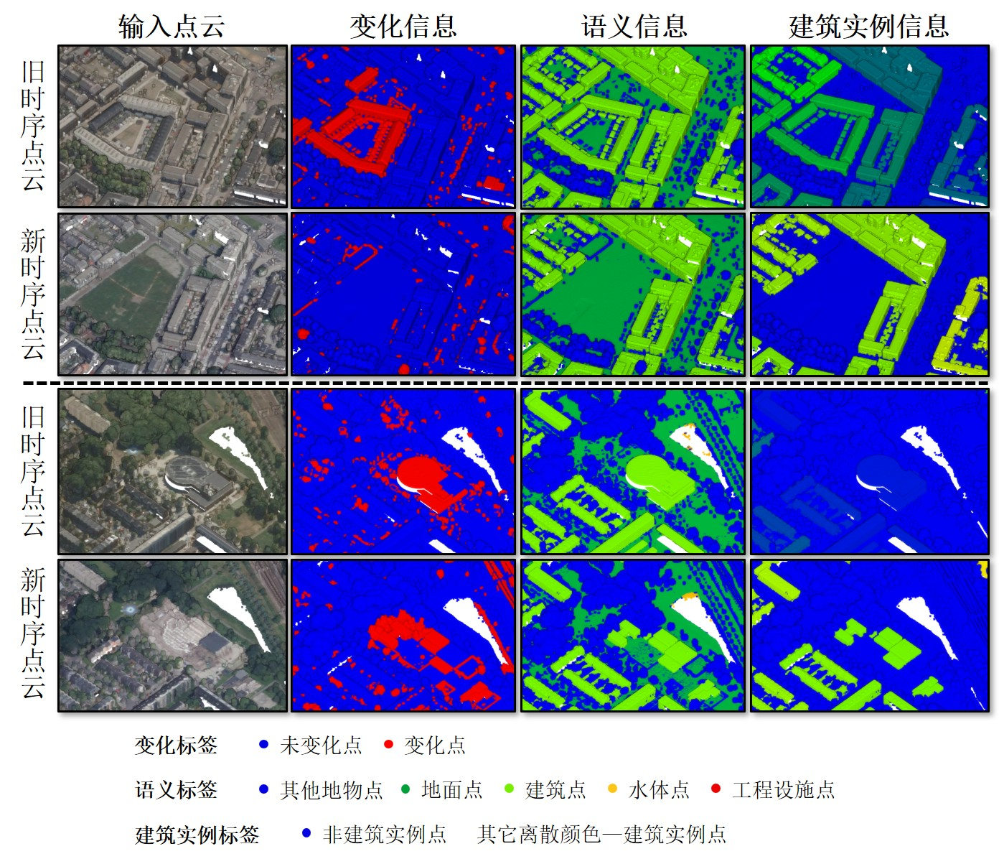

# UtrMGCD

         

# Overview

荷兰乌德勒支三维点云多粒度变化检测数据集（UtrMGCD）通过激光雷达点云叠加航空影像描述了荷兰乌德勒支部分地区在2014年和2020年的城市三维点云多粒度变化情况。数据集共占地约10 平方公里，总点数约为3.2亿个点，叠加的机载影像为LiDAR点云提供了RGB属性，进一步提高了数据集的真实性。该数据集共包含3个子数据集，分别为二分类变化检测数据集、语义变化检测数据集以及建筑实例变化检测数据集，分别可通过以下链接获取。

二分类变化检测数据集：https://doi.org/10.6084/m9.figshare.31745005

语义变化检测数据集：https://doi.org/10.6084/m9.figshare.31745005

建筑实例变化检测数据集：https://doi.org/10.6084/m9.figshare.31745017
